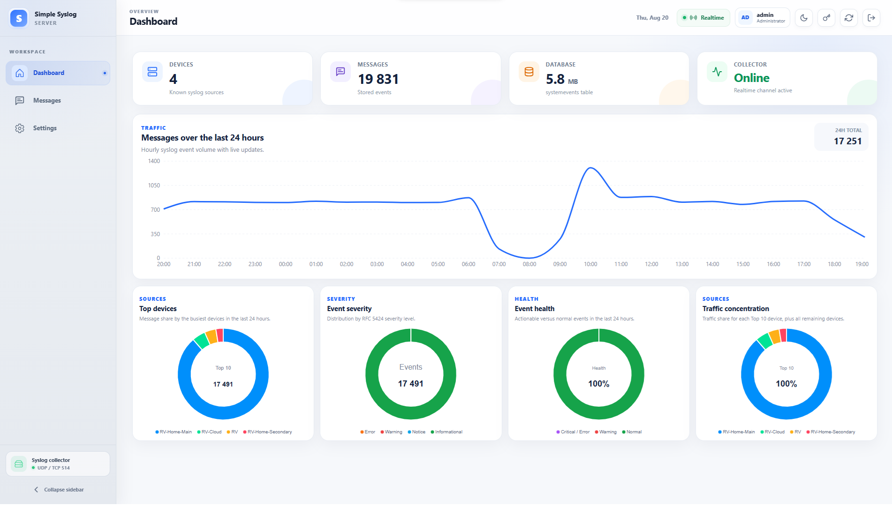
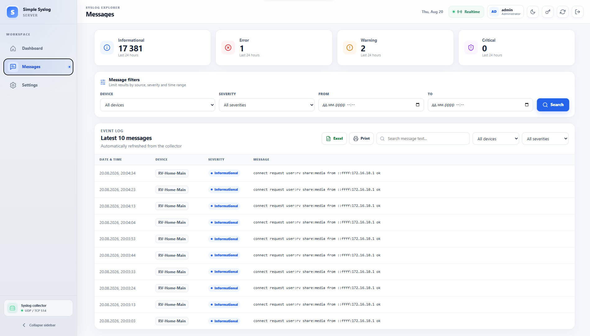
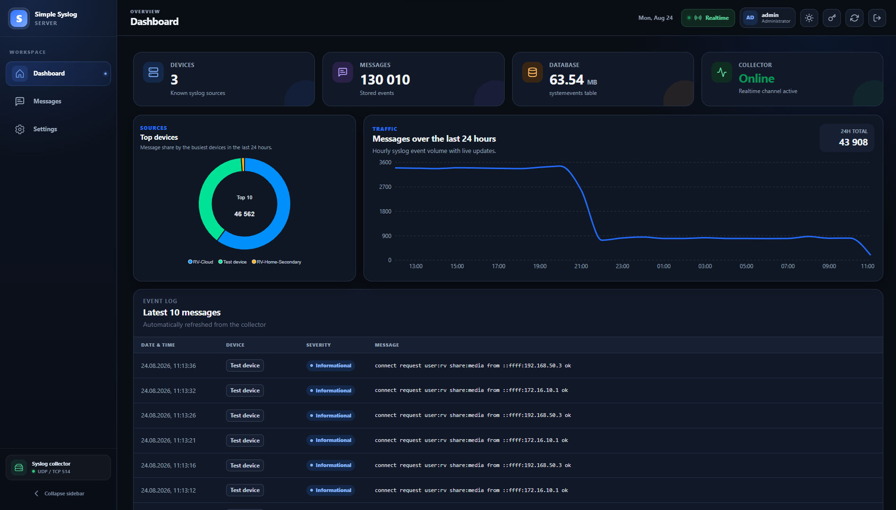
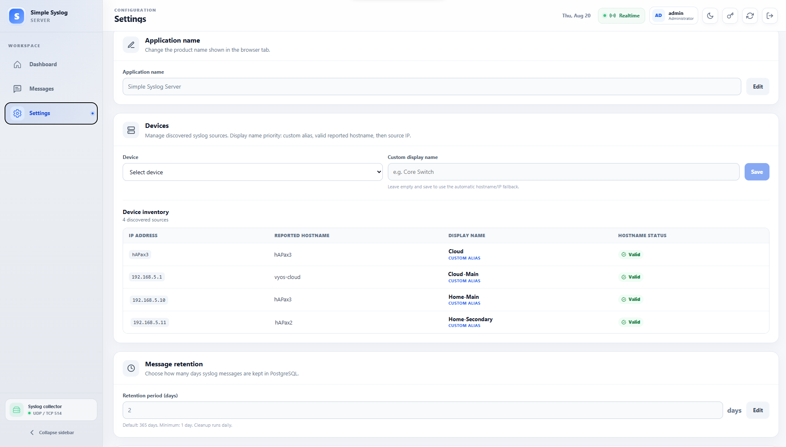

<p align="center">
  
</p>

<h1 align="center">Simple Syslog Server</h1>

<p align="center">
  <strong>SYSLOG SERVER</strong><br>
  <sub>NETWORK MONITORING</sub>
</p>

<p align="center">
  <strong>Modern, lightweight and self-hosted Syslog Server with a real-time web interface.</strong>
</p>

<p align="center">
  Collect • Search • Analyze • Monitor
</p>

<p align="center">
  
  
  
  
  
</p>

---

## Overview

**Simple Syslog Server** is a self-hosted Syslog collection and monitoring platform designed for network devices, servers and infrastructure.

It receives Syslog messages over **UDP/TCP 514**, stores them in PostgreSQL and provides a modern web interface for real-time monitoring, filtering, searching and analysis.

The project is fully containerized and can be deployed with Docker Compose.

It is especially useful for environments with:

- MikroTik routers and switches
- Cisco network equipment
- D-Link / BDCOM / Huawei devices
- Linux servers
- Firewalls
- Virtualization hosts
- Other RFC3164 / RFC5424-compatible Syslog sources

<p align="center">
  
</p>

---

## Dashboard

The Dashboard provides an immediate overview of your Syslog infrastructure.

It includes:

- Total discovered devices
- Message statistics
- PostgreSQL database usage
- Collector status
- 24-hour message traffic graph
- Top devices
- Event severity distribution
- Event health
- Traffic concentration
- Real-time updates without visible page reloads

---

## Messages Explorer

The Messages page provides a powerful interface for working with collected Syslog events.

### Features

- Latest messages view
- Automatic live updates
- Full message text
- Search inside Syslog messages
- Filter by device
- Filter by severity
- Filter by date and time
- Quick severity filters
- Pagination
- 10 / 25 / 50 / 100 messages per page
- Excel export
- Printable report
- Save report as PDF through the browser print dialog
- Responsive mobile layout

<p align="center">
  
</p>

---

## Analytics

Simple Syslog Server provides several real-time visualizations for understanding message traffic.

### Top devices

Shows the busiest Syslog sources during the last 24 hours.

### Event severity

Displays the distribution of Syslog severity levels.

Semantic colors are used for important events:

- **Informational** — green
- **Warning** — red
- **Critical / Error** — highlighted separately

### Event health

Shows the percentage distribution between:

- Normal
- Warning
- Critical / Error

Example:

```text
Normal             97.84%
Warning             1.72%
Critical / Error    0.44%
```

### Traffic concentration

Shows how much of the total Syslog traffic is generated by each of the Top 10 devices.

Each device has its own traffic percentage, while devices outside the Top 10 are represented as **Other devices**.

---

## Light & Dark Themes

The interface includes both **Light** and **Dark** themes.

The selected theme is remembered automatically by the browser.

<p align="center">
  
</p>

---

## Responsive Interface

The web interface is optimized for desktop, tablet and mobile devices.

On mobile devices, Syslog messages are displayed as responsive cards and full message text is preserved without truncation.

---

## Device Management

Devices are identified primarily by the actual IP address from which the Syslog packet was received.

Vendor-provided hostnames are stored separately.

Display name priority:

```text
Custom alias
     ↓
Valid reported hostname
     ↓
Source IP address
```

This prevents malformed vendor Syslog headers from creating incorrect device names such as:

```text
Aug
2026-08-19
22:15:01
```

Administrators can configure custom device names from **Settings**.

<p align="center">
  
</p>

---

## User Authentication

Simple Syslog Server includes built-in authentication and role-based access control.

### Administrator

Full access to:

- Dashboard
- Messages
- Settings
- Device management
- Message retention
- User management

### Operator

Read-only access to:

- Dashboard
- Messages

Operators cannot modify system configuration.

### Default account

For a new installation:

```text
Username: admin
Password: syslog
```

The default administrator is required to change the password after the first login.

> [!IMPORTANT]
> Change the default password immediately after installation.

---

## Message Retention

Message retention can be configured directly from the web interface.

Default:

```text
365 days
```

Minimum:

```text
1 day
```

Old messages are automatically removed from PostgreSQL by the backend retention task.

---

## Server Time Zone

The application automatically inherits the time zone from the Linux Docker host.

The containers use:

```text
/etc/localtime
/etc/timezone
```

Timestamps displayed in the web interface therefore follow the **server time zone**, not the time zone of the user's browser.

---

## Architecture

```text
                 ┌──────────────────────┐
                 │   Network Devices    │
                 │ Routers / Switches   │
                 │ Servers / Firewalls  │
                 └──────────┬───────────┘
                            │
                       UDP / TCP 514
                            │
                            ▼
                 ┌──────────────────────┐
                 │  rsyslog Collector   │
                 │                      │
                 │  Syslog processing   │
                 │  Persistent queue    │
                 └──────────┬───────────┘
                            │
                            ▼
                 ┌──────────────────────┐
                 │     PostgreSQL       │
                 │                      │
                 │ Messages / Devices   │
                 │ Users / Sessions     │
                 └──────────┬───────────┘
                            │
                    LISTEN / NOTIFY
                            │
                            ▼
                 ┌──────────────────────┐
                 │   Node.js Backend    │
                 │                      │
                 │ REST API / WebSocket │
                 │ Retention / Auth     │
                 └──────────┬───────────┘
                            │
                      /api + /ws
                            │
                            ▼
                 ┌──────────────────────┐
                 │    Nginx + React     │
                 │                      │
                 │    Modern Web UI     │
                 └──────────────────────┘
```

---

## Docker Containers

The stack consists of four main containers:

| Container | Purpose |
|---|---|
| `simple-syslog-postgres` | PostgreSQL database |
| `simple-syslog-collector` | UDP/TCP Syslog collector |
| `simple-syslog-backend` | REST API, WebSocket, authentication and retention |
| `simple-syslog-frontend` | React application served by Nginx |

---

## Requirements

You need:

- Linux server
- Docker Engine
- Docker Compose v2
- UDP 514 available on the host
- TCP 514 available on the host
- A web port, default `8080`

Ubuntu Server is recommended, but any Linux distribution capable of running Docker should work.

---

# Installation

## 1. Clone the repository

```bash
git clone https://github.com/RyVolodya/simple-syslog-server.git
cd simple-syslog-server
```

## 2. Create configuration

```bash
cp .env.example .env
```

Edit it:

```bash
nano .env
```

At minimum, configure a strong PostgreSQL password:

```env
POSTGRES_PASSWORD=CHANGE_ME
```

## 3. Start Simple Syslog Server

```bash
docker compose up -d --build
```

## 4. Check container status

```bash
docker compose ps
```

All containers should be running.

## 5. Open the web interface

```text
http://SERVER_IP:8080
```

Login using:

```text
Username: admin
Password: syslog
```

You will be prompted to change the password.

---

## Default Ports

| Protocol | Port | Purpose |
|---|---:|---|
| UDP | 514 | Syslog |
| TCP | 514 | Syslog |
| TCP | 8080 | Web interface |

Ports can be changed in `.env`.

Example:

```env
SYSLOG_UDP_PORT=514
SYSLOG_TCP_PORT=514
WEB_PORT=8080
```

---

# Sending Syslog Messages

## MikroTik RouterOS

Example configuration:

```routeros
/system logging action
add name=simple-syslog target=remote remote=192.168.1.100 remote-port=514

/system logging
add action=simple-syslog topics=info
add action=simple-syslog topics=warning
add action=simple-syslog topics=error
add action=simple-syslog topics=critical
```

Replace:

```text
192.168.1.100
```

with the IP address of your Simple Syslog Server.

---

## Linux / rsyslog

Create:

```bash
sudo nano /etc/rsyslog.d/60-simple-syslog.conf
```

UDP:

```text
*.* @192.168.1.100:514
```

TCP:

```text
*.* @@192.168.1.100:514
```

Restart rsyslog:

```bash
sudo systemctl restart rsyslog
```

---

# Useful Commands

Show container status:

```bash
docker compose ps
```

Follow all logs:

```bash
docker compose logs -f
```

Collector logs:

```bash
docker compose logs -f collector
```

Backend logs:

```bash
docker compose logs -f backend
```

PostgreSQL shell:

```bash
docker compose exec postgres psql -U syslog -d rsyslog
```

Restart the stack:

```bash
docker compose restart
```

Stop without deleting data:

```bash
docker compose down
```

---

## Data Persistence

Persistent Docker volumes are used for Syslog data and the collector queue.

Normal container recreation:

```bash
docker compose down
docker compose up -d
```

does **not** remove stored messages.

> [!CAUTION]
> The following command deletes persistent application data:

```bash
docker compose down -v
```

---

## Security

Simple Syslog Server includes several security mechanisms:

- Password hashing using Node.js `scrypt`
- Server-side sessions
- `HttpOnly` authentication cookies
- `SameSite=Lax` cookies
- Login rate limiting
- Role-based backend authorization
- Authenticated WebSocket connections
- PostgreSQL is not directly exposed to the network
- Backend API is not directly exposed to the network
- Automatic session expiration
- Password change invalidates other active sessions

When publishing the application through HTTPS, configure:

```env
COOKIE_SECURE=true
```

---

## Technology Stack

### Frontend

```text
React
TypeScript
Vite
ApexCharts
Recharts
Nginx
```

### Backend

```text
Node.js
Express
TypeScript
WebSocket
PostgreSQL
```

### Collector

```text
rsyslog
UDP / TCP Syslog
PostgreSQL output
Persistent queue
```

### Infrastructure

```text
Docker
Docker Compose
```

---

## Project Structure

```text
simple-syslog-server/
├── backend/
│   ├── Dockerfile
│   └── src/
│
├── collector/
│   ├── Dockerfile
│   ├── entrypoint.sh
│   └── rsyslog.conf.template
│
├── database/
│   └── init.sql
│
├── frontend/
│   ├── Dockerfile
│   ├── nginx.conf
│   └── src/
│
├── docs/
│   └── images/
│       ├── logo.png
│       ├── dashboard.png
│       ├── dashboard-dark.png
│       ├── messages.png
│       ├── settings.png
│       ├── dark-theme.png
│       └── mobile.png
│
├── .env.example
├── docker-compose.yml
├── LICENSE
└── README.md
```

---

## Roadmap

Potential future improvements:

- HTTPS configuration examples
- Additional vendor-specific Syslog parsers
- Advanced analytics
- Configurable alerts
- Telegram notifications
- Additional export formats
- Syslog forwarding / relay
- API documentation

---

## Contributing

Issues, bug reports and feature requests are welcome.

If you find a problem or have an idea for improving Simple Syslog Server, feel free to open an Issue.

Pull requests are also welcome.

---

## License

This project is licensed under the **GNU General Public License v3.0**.

See `LICENSE` for details.

---

## Author

Developed by **RyVolodya**.

If you find this project useful, consider giving it a ⭐ on GitHub.

---

<p align="center">
  <strong>Simple Syslog Server</strong><br>
  A simple way to collect, search and understand your infrastructure logs.
</p>
